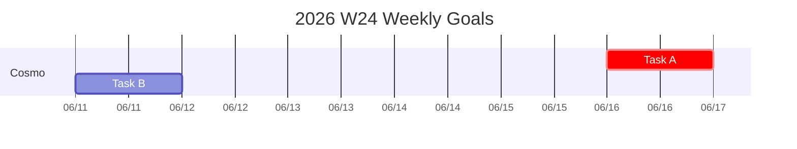

# Markdown to HTML — Markdown 转 HTML 独立页面

将 Markdown 文件转换为带 GitHub 风格样式的独立 HTML 文件，支持 Mermaid 图表、LaTeX 数学公式、任务列表等扩展语法，自动适配深色模式。

> **当前版本：v1.0** | [English](README_EN.md)

## 功能

- **独立 HTML 输出**：CSS 内嵌，单文件即可发布分享，无外部样式依赖
- **GitHub 风格样式**：排版、代码块、表格与 GitHub 渲染效果一致
- **自动深色模式**：通过 `prefers-color-scheme` 自动切换亮/暗主题
- **Mermaid 图表**：支持甘特图、流程图、时序图等，客户端渲染
- **LaTeX 数学公式**：行内 `$...$` 和块级 `$$...$$` 公式，MathJax 渲染
- **任务列表**：`- [ ]` / `- [x]` 复选框，只读展示
- **表格**：居中对齐、单元格合并支持
- **代码块**：围栏代码块语法高亮，横向滚动
- **Table of Contents**：自动生成目录
- **行内换行**：单行换行自动转为 `<br>`，兼容 Obsidian 等编辑器习惯
- **打印优化**：打印时自动适配页面宽度，避免内容截断
- **引用块**：GitHub 风格引用样式

## 快速开始

### 安装依赖

```bash
pip install markdown pymdown-extensions
```

### 命令行使用

```bash
python md2html.py <input.md> [output.html]
```

**示例**：

```bash
# 生成同名 HTML
python md2html.py README.md

# 指定输出文件名
python md2html.py README.md docs/readme.html
```

### 命令行参数

| 参数 | 必选 | 说明 |
|------|------|------|
| `input.md` | ✅ | 输入的 Markdown 文件路径 |
| `output.html` | ❌ | 输出的 HTML 文件路径（默认与输入同名 `.html`） |

## Markdown 语法支持

| 语法 | 说明 |
|------|------|
| 标题 `# ~ ######` | H1 / H2 带底部分割线 |
| 粗体 `**text**` / 斜体 `*text*` | 行内格式 |
| 行内代码 `` `code` `` | 灰底等宽字体 |
| 围栏代码块 ` ``` ` | 语法高亮，横向滚动 |
| 无序列表 `- ` | 自动修复段落中断，正确渲染 |
| 有序列表 `1. ` | 可中断段落 |
| 任务列表 `- [ ]` / `- [x]` | 只读复选框 |
| 表格 `\| col \| col \|` | 支持对齐、合并 |
| 引用 `> text` | GitHub 风格引用块 |
| 链接 `[text](url)` | 超链接 |
| 图片 `` | 自适应宽度，圆角 |
| 水平线 `---` | 分割线 |
| Mermaid ` ```mermaid ` | 客户端渲染图表 |
| LaTeX `$...$` / `$$...$$` | MathJax 数学公式 |
| Frontmatter `---` | YAML 元数据（转为 HTML 段落） |
| 折叠块 `[!note]+` | 引用块格式（Obsidian callout） |

## Mermaid 图表

````markdown

````

支持的图表类型：`gantt`、`flowchart`、`sequenceDiagram`、`classDiagram`、`stateDiagram`、`pie` 等，由 Mermaid 10 客户端渲染。

## LaTeX 数学公式

```markdown
行内公式：$E = mc^2$

块级公式：
$$
\int_{a}^{b} f(x)dx
$$
```

使用 MathJax 3 渲染。`$` 货币符号（如 `$100`）会自动识别，不会被误解析为数学公式。

## 样式特性

| 特性 | 说明 |
|------|------|
| 亮色主题 | 白底黑字，GitHub 色板 |
| 深色主题 | 自动跟随系统设置 `prefers-color-scheme: dark` |
| 响应式 | 最大宽度 900px，居中显示 |
| 打印 | 自动去除宽度限制，避免表格/代码块跨页截断 |
| 字体 | 系统字体栈，代码块等宽字体 |

## 项目结构

```
markdown2html/
├── md2html.py        # 主程序（单文件）
├── README.md          # 中文说明
└── README_EN.md       # English README
```

## 系统要求

- Python 3.8+
- `markdown` >= 3.0
- `pymdown-extensions` >= 10.0
