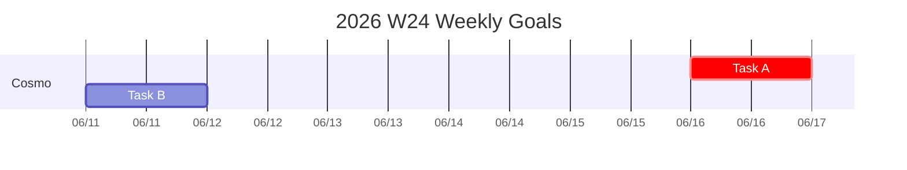

# Markdown to HTML — Standalone Markdown-to-HTML Converter

Convert Markdown files to self-contained, GitHub-styled HTML pages with Mermaid diagram support, LaTeX math rendering, task lists, and automatic dark mode.

> **Current version: v1.0** | [中文](README.md)

## Features

- **Self-contained HTML output**: All CSS inlined — single-file output, ready to share with zero external dependencies
- **GitHub-style design**: Typography, code blocks, and tables render consistently with GitHub's look and feel
- **Automatic dark mode**: Switches between light/dark themes via `prefers-color-scheme` media query
- **Mermaid diagrams**: Gantt charts, flowcharts, sequence diagrams, and more — rendered client-side
- **LaTeX math**: Inline `$...$` and block `$$...$$` formulas rendered by MathJax 3
- **Task lists**: `- [ ]` / `- [x]` checkboxes displayed as read-only
- **Tables**: Column alignment, merged cells, striped rows
- **Code blocks**: Fenced code with syntax highlighting, horizontal scroll for long lines
- **Table of Contents**: Auto-generated from headings
- **Inline line breaks**: Single newlines converted to `<br>`, compatible with Obsidian and similar editors
- **Print-optimized**: Auto-adjusts page width and avoids page breaks inside tables, code blocks, and images
- **Blockquotes**: GitHub-styled quote blocks

## Quick Start

### Install Dependencies

```bash
pip install markdown pymdown-extensions
```

### CLI Usage

```bash
python md2html.py <input.md> [output.html]
```

**Examples**:

```bash
# Output with same base name
python md2html.py README.md

# Specify output path
python md2html.py README.md docs/readme.html
```

### Arguments

| Argument | Required | Description |
|----------|----------|-------------|
| `input.md` | Yes | Path to the input Markdown file |
| `output.html` | No | Path to the output HTML file (default: same name with `.html` extension) |

## Markdown Syntax Support

| Syntax | Notes |
|--------|-------|
| Headings `# ~ ######` | H1 / H2 with bottom border |
| Bold `**text**` / Italic `*text*` | Inline formatting |
| Inline code `` `code` `` | Gray background, monospace font |
| Fenced code blocks ` ``` ` | Syntax highlighting, horizontal scroll |
| Unordered lists `- ` | Auto-fixed to interrupt paragraphs |
| Ordered lists `1. ` | Interrupts paragraphs by default |
| Task lists `- [ ]` / `- [x]` | Read-only checkboxes |
| Tables `\| col \| col \|` | Alignment and merged cells |
| Blockquotes `> text` | GitHub-style quote blocks |
| Links `[text](url)` | Hyperlinks |
| Images `` | Responsive width, rounded corners |
| Horizontal rules `---` | Section dividers |
| Mermaid ` ```mermaid ` | Client-side diagram rendering |
| LaTeX `$...$` / `$$...$$` | MathJax 3 math rendering |
| Frontmatter `---` | YAML metadata (rendered as paragraphs) |
| Callouts `[!note]+` | Obsidian-style callout blocks |

## Mermaid Diagrams

````markdown

````

Supported diagram types: `gantt`, `flowchart`, `sequenceDiagram`, `classDiagram`, `stateDiagram`, `pie`, and more — rendered by Mermaid 10 on the client side.

## LaTeX Math

```markdown
Inline: $E = mc^2$

Block:
$$
\int_{a}^{b} f(x)dx
$$
```

Rendered with MathJax 3. Currency symbols (`$100`, `$6088.42`) are automatically detected and will not be mis-parsed as math delimiters.

## Styling Features

| Feature | Description |
|---------|-------------|
| Light theme | White background, GitHub color palette |
| Dark theme | Follows system `prefers-color-scheme: dark` |
| Responsive | Max width 900px, centered |
| Print | Removes width constraints, avoids page breaks inside pre/table/img |
| Fonts | System font stack, monospace for code |

## Project Structure

```
markdown2html/
├── md2html.py        # Main script (single file)
├── README.md          # Chinese README
└── README_EN.md       # English README
```

## System Requirements

- Python 3.8+
- `markdown` >= 3.0
- `pymdown-extensions` >= 10.0
